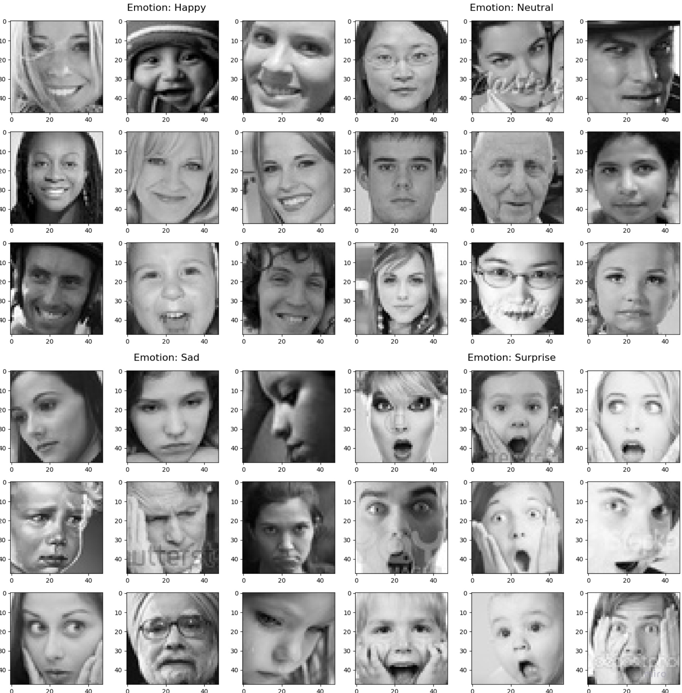
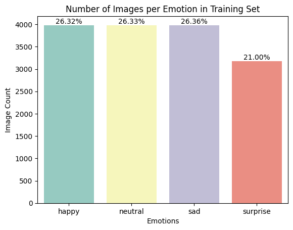
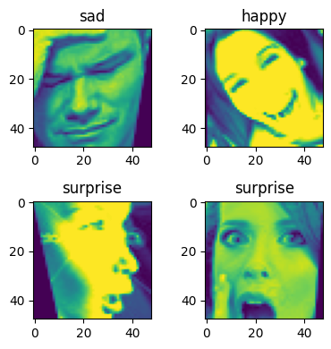

# Facial Emotion Recognition

</img>

Recent research suggests that a significant portion, approximately 55%, of emotional communication primarily relies on facial expressions and other visual cues [1]. Hence, developing a model that precisely recognizes facial emotions represents a major advancement in equipping AI-powered machines with emotional intelligence. Automated facial expression recognition systems offer vast potential across diverse applications, spanning from understanding human behavior and identifying mental health conditions to improving virtual assistants for customer-centric businesses. It’s also important for Emotion Recognition for Human-Robot Interaction [2]. Using Deep Learning and AI techniques to create a computer vision mode that can accurately detect facial emotion is an important step towards the development of emotionally intelligent machines powered by AI. CNN has been extensively used in diverse computer vision applications, including FER. At the beginning of the 21st century, several studies in the Facial Expression Recognition (FER) literature found that the CNN is robust to face location changes and scale variations and behaves better than the multilayer perceptron (MLP) in the case of previously unseen face pose variations [3].

The objective of this project involves leveraging Deep Learning and Artificial Intelligence methodologies to develop a computer vision model. This model aims to precisely identify emotions in facial expressions by performing multi-class classification on images of faces, effectively associating each expression with its corresponding emotion.

## Solution Design

### Data Exploration

We have 20,214 images which are 48x48 in size and with 3 channels (Red Green Blue), consisting of three different image sets which are train, validation and test sets. Each set contains four different emotions (classes) that are happy, neutral, sad and surprised. You may see some of the example images for each emotion from the training set below. 

</img>

As you may see, the dataset contains people from different age groups, different gender and different ethnicity. All images reflect certain characteristics of the related emotions, such as happy people smile, most of these people show their teeth while smiling; sad people frown and some of them are closed eyes even with face palming; surprised people are open mouths and some of them put their hands around their cheeks; and finally people who don’t have any kind of emotion (neutral) the moment the picture taken, don't show any kind of a facial expression which differentiate from the other emotions. Some people are with glasses which might make our model robust against having this type of objects in the images.

Exact number of images for each set and for each emotion can be seen in below table.`

|     |Train|Validation|Test|Total|
|----:|:---:|:--------:|:--:|:---:|
|Happy|3,976|1,825|32|5,833|
|Neutral|3,978|1,216|32|5,226|
|Sad|3,982|1,139|32|5,153|
|Surprised|3,173|797|32|4,002|
|**Total**|**15,109**|**4,977**|**128**|**20,214**|

As you can see in below plot, the training set is almost balanced. That's why we can only focus on the accuracy score metric. However, we might need to pay attention to how the model is performing for the surprise emotion since it has the least number of images.

  </img>

First we convert the images into grayscale. As you can see in the above image even though the images have 3 channels (RGB), all of them are grayscale. Then, we implemented several image augmentation techniques to enhance our dataset. One technique involved a random brightness shift between 0 and 2 for images in the training set. Another augmentation involved horizontal image flipping. Furthermore, we applied random spatial shearing to the training images, allowing up to a 30% shearing effect. These augmentations only applied to the training set not to cause any data leakage. You may see some examples of the augmented images below.

  </img>

Emotion recognition from the facial expressions using CNN

This project has 3 sections:
1. Baseline model which created manually
2. Transfer learning
3. Hyperparameter optimization using Keras Tuner

---
# Bibliography

[1] Mehrabian, A. (2008). Communication without words. Communication theory, 6, 193-200.

[2] Spezialetti, M., Placidi, G., & Rossi, S. (2020). Emotion recognition for human-robot interaction: Recent advances and future perspectives. Frontiers in Robotics and AI, 145.

[3] Li, S., & Deng, W. (2020). Deep facial expression recognition: A survey. IEEE transactions on affective computing, 13(3), 1195-1215.

[4] Dsouza, J. (2020, April). “What is a GPU and do you need one in Deep Learning?”: Towards Data Science. https://towardsdatascience.com/what-is-a-gpu-and-do-you-need-one-in-deep-learning-718b9597aa0d
